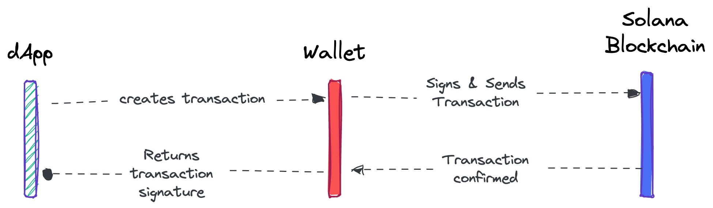
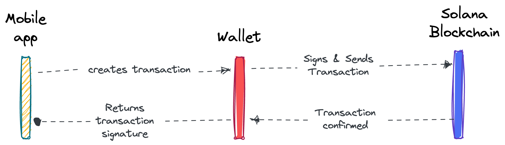

# Solana Pay

`@solana/pay` is a JavaScript library for facilitating commerce on Solana by using a token transfer URL scheme. The URL scheme ensures that no matter the wallet or service used, the payment request must be created and interpreted in one standard way.

## Why use Solana Pay

Businesses and developers can use Solana Pay to accept payments in SOL or any SPL token without intermediaries. It offers frictionless and portable integration options like payment links, pay now buttons or QR codes on your app, dApp, website, blog, and so much more.

## How it works

### Web app to mobile wallet

Payment requests can be encoded as a URL according to the scheme, scanned using a QR code, sent and confirmed by the wallet, and discovered by the app.

### Web app to browser wallet

With a Solana Pay button, you could integrate an embeddable payment button that can be added to your existing app.

### Mobile app to mobile wallet

Payment requests could be encoded as a deep link. The app prepares a payment request, and passes control to the wallet. The wallet signs, sends, and confirms it, or cancels the request and passes control back to the app.

## Getting Started

Learn how to integrate Solana Pay in your website, application or wallet.

### Transaction Requests

A Solana Pay transaction request URL describes an interactive request for any Solana transaction. The parameters in the URL are used by a wallet to make an HTTP request to compose any transaction.

- [Create a transaction request](https://docs.solanapay.com/core/transaction-request/merchant-integration)
- [Test a transaction request URL](https://glow.app/test/solana-pay)

### Transfer Requests

A Solana Pay transfer request URL describes a non-interactive request for a SOL or SPL Token transfer. The parameters in the URL are used by a wallet to directly compose the transaction.

- [Create a transfer request](https://docs.solanapay.com/core/transfer-request/merchant-integration)
- [Handle a transfer request](https://docs.solanapay.com/core/transfer-request/wallet-integration)

## Other resources

- [API Reference](https://docs.solanapay.com/api/core)
- [Brand Guidelines](https://solanapay.com/branding)
- [Solana Pay Buttons](https://www.figma.com/community/file/1070341985720702755)

## License

The Solana Pay JavaScript SDK is open source and available under the Apache License, Version 2.0. See the [LICENSE](./LICENSE) file for more info.
