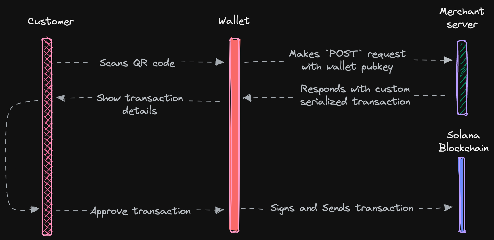

This section describes how a merchant can integrate Solana Pay transaction requests into their payments flow.

This guide walks through an example of how you can configure a server to respond to a Solana Pay transaction request to initiate a simple native SOL transfer.

A complete example can be found [here][4].

## Requirements

For this example, we'll be building our server using [NextJS API routes][1]. There are no rigid requirements on where your server is deployed and what technologies or languages are used.

---

## 1. Set-up Solana Pay

Install Solana Pay libraries to access the API from your application:

**npm**

```shell
npm install @solana/pay @solana/web3.js bignumber.js @solana/spl-token --save
```

**yarn**

```shell
yarn add @solana/pay @solana/web3.js bignumber.js @solana/spl-token
```

### 1. Create the handler

The handler is the entry point of the API, and "handles" all incoming requests.

```javascript
const index = async (request, response) => {
    // We set up our handler to only respond to `GET` and `POST` requests.
    if (request.method === 'GET') return get(request, response);
    if (request.method === 'POST') return post(request, response);

    throw new Error(`Unexpected method ${request.method}`);
};
```

## 2. The link

A Solana Pay transaction request URL describes an interactive request for any Solana transaction.

```html
solana:<link>
```

A single [link][3] field is required as the pathname. The value must be an absolute HTTPS URL. If the URL contains query parameters, it must be URL-encoded.

```html
solana:https://example.solanapay.com
```

Our server `https://example.solanapay.com` needs to be configured to respond correctly to `GET` and `POST` requests.

## 3. The GET request

The first part of the transaction request spec is for the wallet to make a `GET` request to the specified link.

```javascript
const get = async (request, response) => {
    const label = 'Exiled Apes Academy';
    const icon = 'https://exiledapes.academy/wp-content/uploads/2021/09/X_share.png';

    response.status(200).send({
        label,
        icon,
    });
};
```

The `GET` endpoint should respond with two properties. `label` describes the source of the transaction request. For example, this might be the name of a brand, store, application, or person making the request. `icon` must be an SVG, PNG, or WebP image. The icon and label will be displayed to the user.

## 4. The POST request

The second part of the transaction request spec is the `POST` request.

```javascript
import { clusterApiUrl, Connection, Keypair, PublicKey, Transaction } from '@solana/web3.js';
import BigNumber from 'bignumber.js';
import { createTransferCheckedInstruction, getAccount, getAssociatedTokenAddress, getMint } from '@solana/spl-token';
import { TEN } from '@solana/pay';

const splToken = new PublicKey(process.env.USDC_MINT);
const MERCHANT_WALLET = new PublicKey(process.env.MERCHANT_WALLET);

const post = async (request, response) => {
    // Account provided in the transaction request body by the wallet.
    const accountField = request.body?.account;
    if (!accountField) throw new Error('missing account');

    const sender = new PublicKey(accountField);

    // create spl transfer instruction
    const splTransferIx = await createSplTransferIx(sender, connection);

    // create the transaction
    const transaction = new Transaction();

    // add the instruction to the transaction
    transaction.add(splTransferIx);

    // Serialize and return the unsigned transaction.
    const serializedTransaction = transaction.serialize({
        verifySignatures: false,
        requireAllSignatures: false,
    });

    const base64Transaction = serializedTransaction.toString('base64');
    const message = 'Thank you for your purchase of ExiledApe #518';

    response.status(200).send({ transaction: base64Transaction, message });
};
```

The wallet will make a `POST` request to the specified link with the user's wallet address as the `account` property of the request body.

The `POST` endpoint should respond with a base64-encoded `transaction`. You can return an optional `message` property to describe the transaction.

### 4.1 The transaction response

The `transaction` that's returned can be -- anything. It doesn't even need to be a payment. For example, it could be a transaction to receive a gift or an invitation from the merchant for scanning a wallet.

<details>
    <summary>Some ideas of what transactions you can do.</summary>

-   Merchants get an atomic bidirectional communication channel with customers. They can mint an NFT or transfer loyalty reward tokens in the transaction.
-   Merchants could potentially see what tokens a user has, accepting and denominating payment in any of them.
-   Merchants can pay for transactions on their user's behalf so they don't need SOL in a wallet.
-   Merchants can return an error from the server to decline to respond with a transaction. This could be used to allow permissioned payments.
-   Payments can be directed to escrow-like programs, enabling things like refunds, chargebacks, and other return mechanisms.
-   DeFi transactions could be bridged to all kinds of web2 / IRL portals.
-   Wallets can retrieve other information, or merchants can pass it to them, like an icon to display, or other fields in the JSON response.
-   It doesn't even need to be a payment. Merchants could send tokens, invitations, gifts to customers that connect a wallet, perhaps one that meets some criteria, such as possessing an NFT.

</details>

```javascript
async function createSplTransferIx(sender, connection) {
    const senderInfo = await connection.getAccountInfo(sender);
    if (!senderInfo) throw new Error('sender not found');

    // Get the sender's ATA and check that the account exists and can send tokens
    const senderATA = await getAssociatedTokenAddress(splToken, sender);
    const senderAccount = await getAccount(connection, senderATA);
    if (!senderAccount.isInitialized) throw new Error('sender not initialized');
    if (senderAccount.isFrozen) throw new Error('sender frozen');

    // Get the merchant's ATA and check that the account exists and can receive tokens
    const merchantATA = await getAssociatedTokenAddress(splToken, MERCHANT_WALLET);
    const merchantAccount = await getAccount(connection, merchantATA);
    if (!merchantAccount.isInitialized) throw new Error('merchant not initialized');
    if (merchantAccount.isFrozen) throw new Error('merchant frozen');

    // Check that the token provided is an initialized mint
    const mint = await getMint(connection, splToken);
    if (!mint.isInitialized) throw new Error('mint not initialized');

    // You should always calculate the order total on the server to prevent
    // people from directly manipulating the amount on the client
    let amount = calculateCheckoutAmount();
    amount = amount.times(TEN.pow(mint.decimals)).integerValue(BigNumber.ROUND_FLOOR);

    // Check that the sender has enough tokens
    const tokens = BigInt(String(amount));
    if (tokens > senderAccount.amount) throw new Error('insufficient funds');

    // Create an instruction to transfer SPL tokens, asserting the mint and decimals match
    const splTransferIx = createTransferCheckedInstruction(
        senderATA,
        splToken,
        merchantATA,
        sender,
        tokens,
        mint.decimals
    );

    // Create a reference that is unique to each checkout session
    const references = [new Keypair().publicKey];

    // add references to the instruction
    for (const pubkey of references) {
        splTransferIx.keys.push({ pubkey, isWritable: false, isSigner: false });
    }

    return splTransferIx;
}
```

For our example, we create a simple transfer for a SPL token, serialize the transaction, and base64 encode it.

## Best Practices

We recommend handling a customer session in a secure environment. Building a secure integration with Solana Pay requires a payment flow as follows:



1. Customer goes to the payment page
2. Merchant frontend (client) sends order information to the backend
3. Merchant backend (server) generates a reference public key and stores it in a database with the expected amount for the shopping cart / pending purchase (unique to each customer's checkout session).
4. Merchant backend redirects the user to the confirmation page with the generated reference public key.
5. The confirmation page redirects to the merchant with the transaction signature.
6. Merchant backend checks that the transaction is valid for the checkout session by validating the transaction with the reference and amount stored in step 3.

<!-- References -->

[1]: https://nextjs.org/docs/api-routes/introduction
[2]: https://github.com/solana-labs/solana-pay/tree/link-request/point-of-sale
[3]: https://github.com/solana-labs/solana-pay/blob/link-request/SPEC.md#link
[4]: https://github.com/solana-labs/solana-pay
