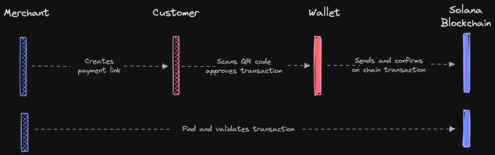
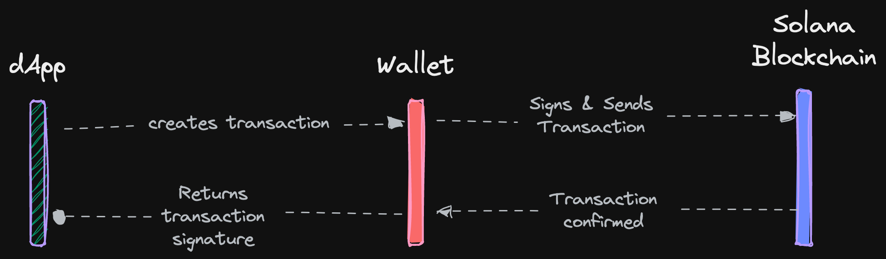
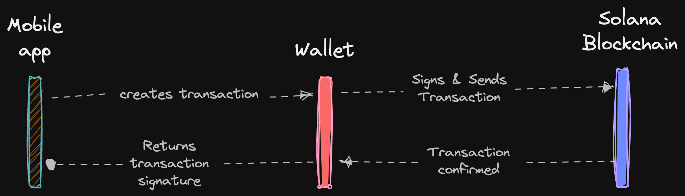

Learn how to integrate transfer requests into your payments flow.

## How it works

### Web app to mobile wallet

Payment requests can be encoded as a URL according to the scheme, scanned using a QR code, sent and confirmed by the wallet, and discovered by the app.

### Web app to browser wallet

With a Solana Pay button, you could integrate an embeddable payment button that can be added to your existing app.

### Mobile app to mobile wallet

Payment requests could be encoded as a deep link. The app prepares a payment request, and passes control to the wallet. The wallet signs, sends, and confirms it, or cancels the request and passes control back to the app.
